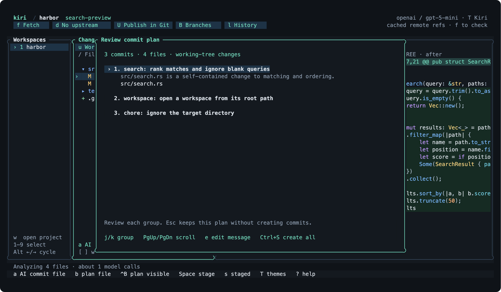
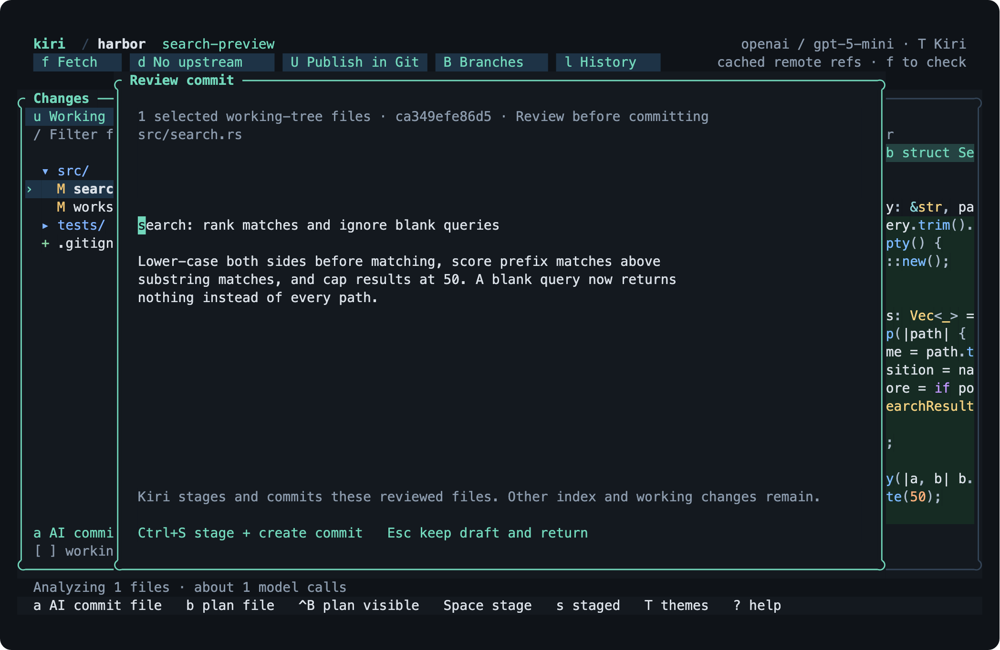
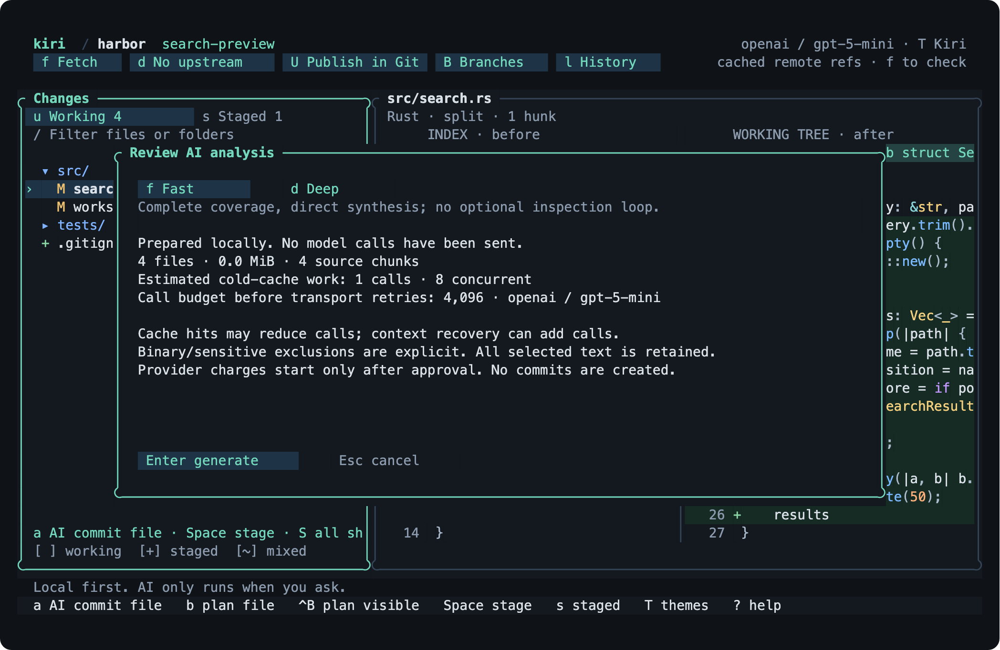
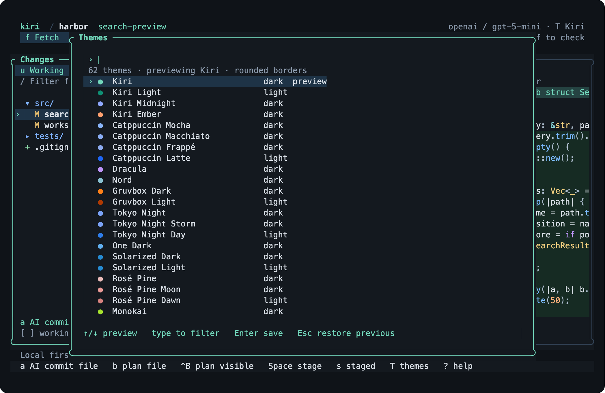

<p align="center">
  <picture>
    <source media="(prefers-color-scheme: dark)" srcset="assets/brand/horizon/logo/horizontal-silver.svg">
    
  </picture>
</p>

<p align="center">The Git client where a model proposes the commits and you approve them.</p>

<p align="center">
  
</p>

Kiri is a terminal Git client written in Rust. Open it in a repository and you get the changed files and the diff. Press `b`, and a model reads the changes you selected, splits them into commits that each do one thing, and writes a message for each. You read the plan, edit what you disagree with, and press `Ctrl+S`. Kiri stages exactly those files and creates the commits in order, with your hooks running.

That is the whole product. Everything else in the UI exists so you can check the model's work before it becomes history.

## What AI-native means here

Most Git UIs bolt AI onto one text box. Kiri's commit flow is a proposal followed by a review, and the review enforces the rules below.

**The model sees the real change.** Kiri hands it the complete patch for every selected file, read from private Git objects, not a truncated preview. Large selections are chunked, summarized in parallel, and reduced. In Deep mode (`d` in the cost review, or `--mode deep`) the model can ask for exact pages of the original patch before it answers.

**Proposals are scoped to paths, not to "whatever is staged".** Pick a file, a folder, or the whole tab. The draft or plan carries those exact paths through to the commit. Anything else you had staged stays staged. On the Working tab, Kiri stages the reviewed files for you at commit time.

**You see the cost before the call.** Kiri prepares the evidence locally, then tells you how many files, how many bytes, and roughly how many model calls it will take. Small requests (12 calls or fewer by default) skip straight to analysis; larger ones wait for you. Set `ui.auto_approve_calls` in `settings.json` to `0` to review every request.

**Kiri checks that the world did not move.** Before committing, it re-reads HEAD, the current branch, the index, and fingerprints of the selected files. If any of them changed since the model saw them, Kiri refuses the commit rather than committing something you did not review.

**Nothing leaves your machine until you press a key.** Browsing files, reading diffs, and staging never contact a provider. There is no Kiri account and no telemetry. API keys live in `~/.config/kiri` with owner-only permissions.

<p align="center">
  
  
</p>

## Install

Requires Git and Rust 1.93 or newer. macOS and Linux. No prebuilt binaries yet.

```sh
git clone https://github.com/Verbiflow/kiri
cd kiri && make install
kiri -C /path/to/repo
```

`make install` puts `kiri` in `~/.cargo/bin`. Set `INSTALL_ROOT` to change that.

Then press `P` inside Kiri to connect a provider. Google Gemini, xAI, the OpenAI API, a ChatGPT subscription (browser sign-in), Anthropic, Amazon Bedrock, and Azure OpenAI are supported. Keys are never passed on the command line.

## Using it

<p align="center">
  
</p>

The left panel is the file tree for the current tab, Working or Staged. The right panel is the diff for the selected file, split or unified, syntax highlighted. Folders show which files a staging action will touch, including collapsed ones.

| | |
| --- | --- |
| `j` `k` | Move through files, folders, and diff rows |
| `Enter` | Open a folder or diff. `Esc` goes back |
| `Space` | Stage or unstage the file or folder |
| `H` | Stage or unstage the selected hunk. `[` `]` jump between hunks |
| `u` `s` | Working tab, Staged tab |
| `/` | Fuzzy filter files and folders |
| `v` | Split or unified diff |
| `b` | Plan commits from the selected file or folder |
| `Ctrl+B` | Plan commits from everything visible on this tab |
| `a` | Draft one commit message for the selected file or folder |
| `A` | Draft one commit message for everything on this tab |
| `c` | Write the message yourself |
| `Ctrl+S` | Create the reviewed commit, or every commit in the plan |
| `f` `d` `U` | Fetch, fast-forward pull, push |
| `B` `l` | Branches, history |
| `P` `T` | Providers, themes |
| `Ctrl+P` | Command palette |
| `?` | Everything else |

The mouse works too. `T` opens a picker with 62 themes; moving the selection previews every panel and syntax color, `Enter` keeps it, `Esc` restores the previous one.

<p align="center">
  
  
</p>

## From a shell

Every TUI action has a subcommand, most with `--json`. The plan flow works the same way, with a file in between so a script or a person can read it.

```sh
kiri status --json
kiri stage src/
kiri draft src/ --json            # one message for the staged files under src/
kiri plan --json > plan.json      # group all staged changes into commits
kiri apply plan.json --yes        # create them, in order
```

`kiri --help` lists the rest, including `provider connect`, `provider login codex`, and a read-only benchmark.

## Embedding

The TUI is one client of a headless engine. `kiri-engine` speaks a length-prefixed, schema-checked protocol over stdio, and [`packages/client`](packages/client) is a TypeScript client generated from that schema. A host can prepare a path selection, call `repo.plan(...)` with its own model callback, inspect the typed `CommitPlan`, and apply it with `repo.applyPlan(...)`. The model callback never sees credentials.

```ts
import { KiriClient } from '@kiri/client';

const client = await KiriClient.connect({ binary: '/path/to/kiri-engine' });
const repo = await client.open('/path/to/repository');
const { status } = await repo.status();
await repo.close();
```

Build the engine with `make install-engine` and check the client package with `make sdk-check`.

## Speed

The review has to be pleasant or nobody reads the diff. Status is computed in-process with gitoxide and cross-checked against `git status` by a differential test suite; states the mapping does not reproduce, such as conflicts and submodules, fall back to Git. Patches are cached by blob ID plus one `lstat`, so an unchanged repository never re-runs a diff. Launch spawns no Git process before the first file inventory; the first `git diff` comes after it.

Median of 20 warm runs per client on macOS ARM64, interquartile range in parentheses. Same disposable repository for both, GitUI 0.28.1 from Homebrew, client order rotated every run.

| | Kiri | GitUI |
| --- | ---: | ---: |
| Launch to visible patch, 100 changed files | 32 ms (31–36) | 20 ms (19–38) |
| Launch to visible patch, 5,000 changed files | 90 ms (83–92) | 94 ms (75–241) |
| Next file after a keypress, 100 files | 1.9 ms | 1.8 ms |
| Next file after a keypress, 5,000 files | 2.1 ms | 8.5 ms |
| Git processes during 6 s idle | 1 | 0 |

Every sample is in [`benchmarks/local-baseline.json`](benchmarks/local-baseline.json). Reproduce with `scripts/benchmark_clients.py --kiri target/release/kiri --gitui $(which gitui) --runs 21`.

## Development

```sh
make check                      # fmt, clippy, tests
make smoke                      # drives the TUI in a real PTY
python3 scripts/screenshots.py  # regenerates the images above
```

The screenshots come from the release binary running in a PTY against a disposable repository. The AI screens use a scripted model, a local server that answers with a fixed plan and draft, so they are reproducible without an API key. Everything else in those frames, including capture, cost estimation, and the review overlays, is Kiri's real code.

Crates: `kiri-core` (Git), `kiri-analysis` (evidence and proposals), `kiri-ai` (providers), `kiri-service` (engine), `kiri-tui`, `kiri-cli`.

Early preview. Merge, rebase, and conflict editing stay in Git for now. MIT licensed.
