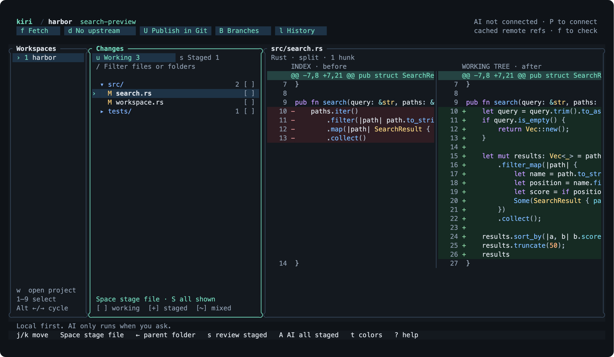
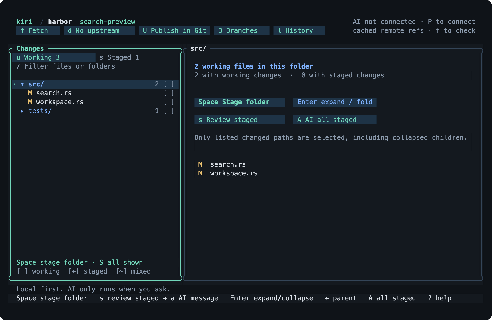
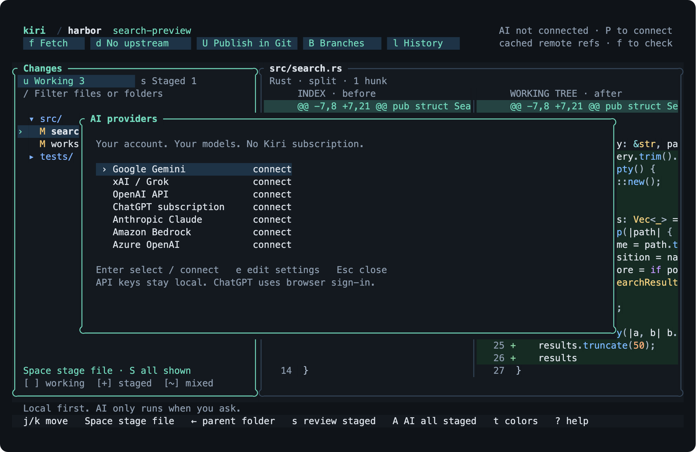

<p align="center">
  <picture>
    <source media="(prefers-color-scheme: dark)" srcset="assets/brand/horizon/logo/horizontal-silver.svg">
    
  </picture>
</p>

<p align="center">A fast Git TUI. Syntax-highlighted diffs, folder staging, AI commit messages when you ask for them.</p>

<p align="center">
  
</p>

Kiri opens the changed-file list first and loads a diff only when you select it. Stage a file, a folder, or a hunk, review what is about to be committed, then commit. Git runs locally. A model is called only when you press a key that asks for one.

## Install

Requires Git and Rust 1.93 or newer. macOS and Linux. No prebuilt binaries yet.

```sh
git clone https://github.com/Verbiflow/kiri
cd kiri && make install
kiri -C /path/to/repo
```

`make install` puts `kiri` in `~/.cargo/bin`. Set `INSTALL_ROOT` to change that.

## Keys

| | |
| --- | --- |
| `j` `k` | Move through files and folders |
| `Enter` | Expand or collapse a folder |
| `Space` | Stage or unstage the selection |
| `H` | Stage the selected hunk |
| `s` `u` | Switch between staged and working changes |
| `c` | Write a commit message |
| `a` `A` | Draft a message with AI for the selection, or for everything staged |
| `Ctrl+S` | Create the reviewed commit |
| `?` | Everything else |

Mouse works too. Split and unified diffs, a fuzzy file filter, branches, history, fetch, fast-forward pull, and push are all built in.

<p align="center">
  
  
</p>

## AI

Press `P` and connect Gemini, Anthropic, OpenAI, xAI, Azure OpenAI, Bedrock, or a ChatGPT subscription. Keys stay on your machine. There is no Kiri account.

Drafts are proposals. You can edit them, and nothing is committed until you press `Ctrl+S`. Before committing, Kiri checks that the index and branch still match what you reviewed, and normal Git hooks run. Large selections are chunked and summarized, but the full patch is always captured and the TUI asks before making a large batch of model calls.

`kiri plan` proposes several commits for a staged folder. Plans split at file boundaries, and applying one needs explicit approval.

## Scripting

```sh
kiri status --json
kiri stage src/
kiri draft src/ --json
kiri plan --json
```

`kiri --help` lists the rest, including provider setup and the read-only benchmark.

## Embedding

The TUI is one client of a reusable engine. `kiri-engine` is a headless sidecar with a length-prefixed, schema-checked protocol, and [`packages/client`](packages/client) is a generated TypeScript client for it.

```ts
import { KiriClient } from '@kiri/client';

const client = await KiriClient.connect({ binary: '/path/to/kiri-engine' });
const repo = await client.open('/path/to/repository');
const { status } = await repo.status();
await repo.close();
```

Build the engine with `make install-engine` and validate the client package with `make sdk-check`.

## Speed

Warm median time from launch to a visible patch, macOS ARM64, same repository and selection for each client:

| Changed files | Kiri | GitUI 0.28 | Lumen 2.32 |
| ---: | ---: | ---: | ---: |
| 100 | 72 ms | 18 ms | 579 ms |
| 5,000 | 226 ms | 143 ms | 6,589 ms |

GitUI is faster. Most of Kiri's time on the large repository is Git's own index refresh. Samples and method are in [`benchmarks/local-baseline.json`](benchmarks/local-baseline.json); reproduce with `scripts/benchmark_clients.py`.

## Development

```sh
make check   # fmt, clippy, tests
make smoke   # drives the TUI in a real PTY
python3 scripts/screenshots.py   # regenerates the images above
```

Crates: `kiri-core` (Git), `kiri-analysis` (evidence graph and proposals), `kiri-ai` (providers), `kiri-service` (engine), `kiri-tui`, `kiri-cli`.

Early preview. Merge, rebase, and conflict editing stay in Git for now. MIT licensed.
