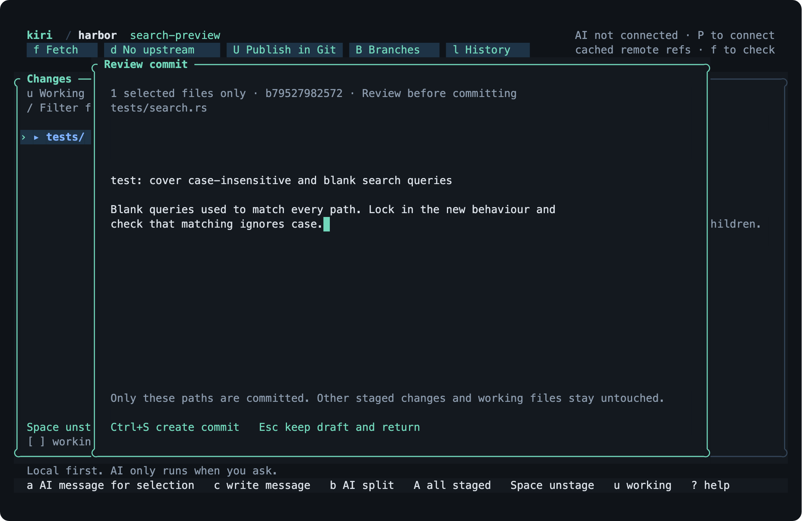

<p align="center">
  <picture>
    <source media="(prefers-color-scheme: dark)" srcset="assets/brand/horizon/logo/horizontal-silver.svg">
    
  </picture>
</p>

<p align="center">A Git TUI for people who read the diff before they commit.</p>

<p align="center">
  
</p>

Kiri is a terminal Git client written in Rust. It opens on the changed-file tree, syntax-highlights the diff you pick, and stages a file, a folder, or a single hunk. Press one key to turn the selected staged or working changes into a reviewed AI commit using your own Claude, OpenAI, Gemini, or xAI account. Nothing is sent anywhere until you ask.

If you have used lazygit or gitui, the layout will feel familiar. The difference is the review flow: Kiri shows exactly which paths a commit will contain before it runs `git commit`.

## Install

Requires Git and Rust 1.93 or newer. macOS and Linux. No prebuilt binaries yet.

```sh
git clone https://github.com/Verbiflow/kiri
cd kiri && make install
kiri -C /path/to/repo
```

`make install` puts `kiri` in `~/.cargo/bin`. Set `INSTALL_ROOT` to change that.

## Keys

| | |
| --- | --- |
| `j` `k` | Move through files, folders, and diff rows |
| `Enter` | Open a folder or diff. `Esc` goes back |
| `Space` | Stage or unstage the file or folder |
| `H` | Stage or unstage the selected hunk. `[` `]` jump between hunks |
| `s` `u` | Show staged or working changes |
| `/` | Fuzzy filter files and folders |
| `v` | Split or unified diff |
| `c` | Write a commit message for the selection |
| `a` | AI commit the selected file or folder on either tab |
| `A` | AI commit everything shown on the current tab |
| `b` | Ask AI to split the current tab into cohesive commits |
| `Ctrl+S` | Create the reviewed commit |
| `T` | Preview and choose a theme |
| `f` `d` `U` | Fetch, fast-forward pull, push |
| `B` `l` | Branches, history |
| `?` | Everything else |

Mouse works too. `Ctrl+P` opens a command palette.

The theme picker has 62 dark, light, and terminal-native themes. Type to filter the list; moving the selection previews every panel, diff tint, and syntax color. Enter saves the theme and Esc restores the previous one. The command palette also cycles rounded, plain, double, and thick panel borders.

<p align="center">
  
  
</p>

## AI only when you ask

Press `P` and connect Gemini, Anthropic, OpenAI, xAI, Azure OpenAI, Bedrock, or a ChatGPT subscription. API keys are stored on your machine. There is no Kiri account and no telemetry.

A draft is a proposal. Edit it, or throw it away. On the Working tab, `a` and `A` capture the chosen files without changing the real index; `Ctrl+S` stages and commits only that reviewed scope. On the Staged tab, the same keys commit from the frozen index snapshot. Kiri checks the files, index, branch, and HEAD before every commit, then runs the normal Git hooks.

`b` sends the whole current tab through the hybrid analyzer, then asks the model to group every file by purpose. The planning prompt keeps implementation with its tests and generated output, separates mechanical edits and unrelated fixes, and orders dependencies before their callers. Working-tree plans stage each reviewed group immediately before its commit; changes outside the plan remain untouched. `kiri plan` offers the same flow for staged changes from a shell.

Selections estimated at 12 model calls or fewer start as soon as you press the AI key. Larger selections still show the cost review first. Set `ui.auto_approve_calls` in `settings.json` to another limit, or to `0` to review every AI request.

<p align="center">
  
</p>

## Scripting

Every TUI action has a subcommand, most with `--json` output.

```sh
kiri status --json
kiri stage src/
kiri draft src/ --json
kiri plan --json
```

`kiri --help` lists the rest, including provider setup and a read-only benchmark.

## Embedding

The TUI is one client of a headless engine. `kiri-engine` speaks a length-prefixed, schema-checked protocol over stdio, and [`packages/client`](packages/client) is a generated TypeScript client for it.

```ts
import { KiriClient } from '@kiri/client';

const client = await KiriClient.connect({ binary: '/path/to/kiri-engine' });
const repo = await client.open('/path/to/repository');
const { status } = await repo.status();
await repo.close();
```

Build the engine with `make install-engine` and validate the client package with `make sdk-check`.

## Speed

Median of 20 warm runs per client on macOS ARM64, interquartile range in parentheses. Same disposable repository and selection for each client, GitUI 0.28.1 from Homebrew, client order rotated every run.

| | Kiri | GitUI |
| --- | ---: | ---: |
| Launch to visible patch, 100 changed files | 32 ms (31–36) | 20 ms (19–38) |
| Launch to visible patch, 5,000 changed files | 90 ms (83–92) | 94 ms (75–241) |
| Next file after a keypress, 100 files | 1.9 ms | 1.8 ms |
| Next file after a keypress, 5,000 files | 2.1 ms | 8.5 ms |
| Git processes during 6 s idle | 1 | 0 |

Status is computed in-process with gitoxide on a thread pool and is checked against `git status` output by a differential test suite; repository states the mapping does not reproduce exactly, such as conflicts and submodules, are computed by Git itself. Patches are cached by the blob IDs in that status plus one `lstat`, the next files are read ahead, and an unchanged repository never re-runs a diff. What remains on launch is the first `git diff`. Every sample and the load average at each run are in [`benchmarks/local-baseline.json`](benchmarks/local-baseline.json); reproduce with `scripts/benchmark_clients.py --kiri target/release/kiri --gitui $(which gitui) --runs 21`.

## Development

```sh
make check                      # fmt, clippy, tests
make smoke                      # drives the TUI in a real PTY
python3 scripts/screenshots.py  # regenerates the images above
```

Crates: `kiri-core` (Git), `kiri-analysis` (evidence graph and proposals), `kiri-ai` (providers), `kiri-service` (engine), `kiri-tui`, `kiri-cli`.

Early preview. Merge, rebase, and conflict editing stay in Git for now. MIT licensed.
